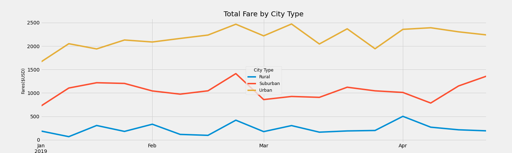

# Module 5: Using Matplotlib to Visualize & Analyze PyberRides Data
## Resources

- **Data Source:** 
  - [city_data.csv](Resources/city_data.csv)
  - [PyBer_ride_data.csv](Resources/PyBer_ride_data.csv)
  - [ride_data.csv](Resources/ride_data.csv)
- **Software:** Python 3.7.10, Matplotlib 3.3.4, Numpy 1.20.1, Statitics 1.0.3.5, SciPy 1.6.2

## Challenge Project Overview 

Using Matplotlib, Python, Pandas, SciPy, and Jupyter Labs, I created visualizations of rideshare data for PyBer to help improve access to ride-sharing services and determine affordability for underserved neighborhoods. With Pandas and Jupyter Lab, I cleaned the data into Data Series or DataFrames, so we could use Matplotlib's features to create and annotate charts that visualize data. In this module, I created charts, scatter plots, bubble charts, pie charts, and box-and-whisker plots, and make them visually compelling and informative by adding titles, axes labels, legends, and custom colors.

## Challange Project Analysis

**Analysis Results:**
  - Analysis Results Notebook: [PyBer_Challenge.ipynb](PyBer_Challenge.ipynb)
  - Analysis Line Chart: 

## Challange Project Summary

